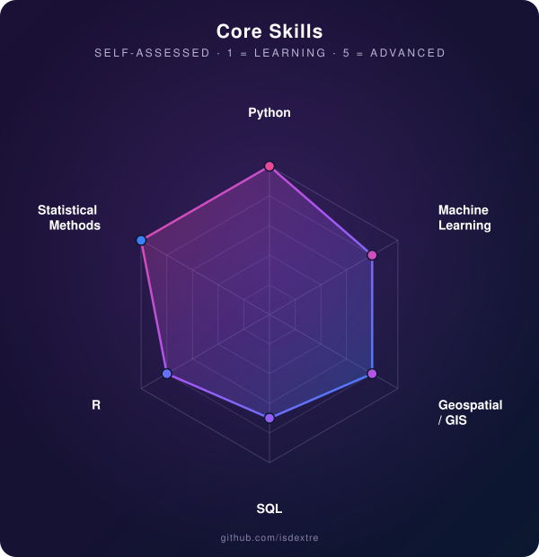

<h1 align="center">Sofía Dextre</h1>

  Statistical Engineering · Applied ML · Spatial Statistics 
  Lima, Perú · <a href="https://linkedin.com/in/sofiadextre">LinkedIn</a> · sofiadextre09@gmail.com

  
  
  
  
  
  

---

### About

Statistical Engineering researcher turning data into decisions — small-area estimation, applied ML, and geospatial statistics for real financial and social problems. Currently a Research Intern in Statistical and Computational Methods, working on game-theoretic models of financing decisions under incomplete information.

`> open to research collaboration`

---

### Core Skills

  

---

### Contribution Activity

  <picture>
    <source media="(prefers-color-scheme: dark)" srcset="https://raw.githubusercontent.com/isdextre/isdextre/output/github-contribution-grid-snake-dark.svg" />
    <source media="(prefers-color-scheme: light)" srcset="https://raw.githubusercontent.com/isdextre/isdextre/output/github-contribution-grid-snake.svg" />
    
  </picture>

Generated automatically every day by a GitHub Action in this repo (<code>.github/workflows/snake.yml</code>) — updates the first time the workflow runs.

---

### Featured Projects

- **Geospatial Small-Area Estimation of Multidimensional Poverty in Peru** — spatial Fay–Herriot / EBLUP model estimating the MPI for all 1,892 Peruvian districts using survey, administrative, and satellite data. 1st place, Statistical Engineering Program, UNI. *(Code private while the underlying thesis is unpublished — see repo README for the full methodology.)*
- **[NPS Prediction with NLP — Rímac Seguros Hackathon](https://github.com/isdextre/Data-science-applied-projects)** — NLP model predicting Net Promoter Score from customer feedback. 1st place, Rímac Seguros Hackathon.
- **[Savings Propensity Model](https://github.com/isdextre/Data-science-applied-projects)** — predictive model for savings potential. 1st place, MiBanco Datathon.
- **[Time-Series Forecasting of Egg Prices in Peru](https://github.com/isdextre/Data-science-applied-projects)** — trend/seasonality analysis, stationarity testing, and forecast validation.

---

  
  

